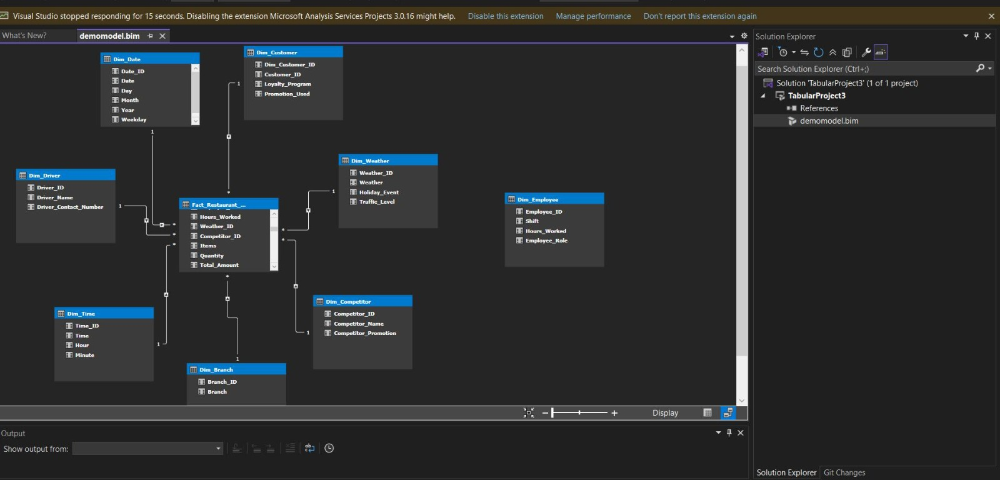
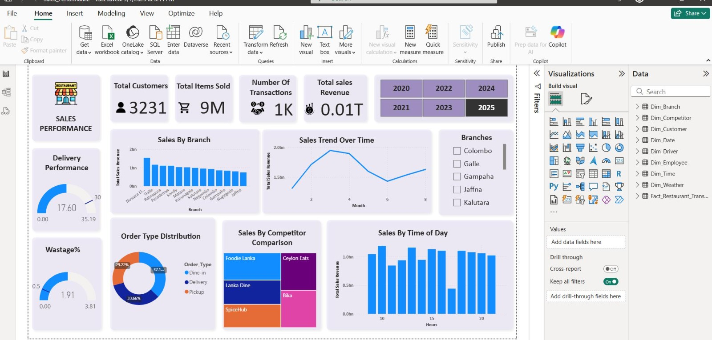
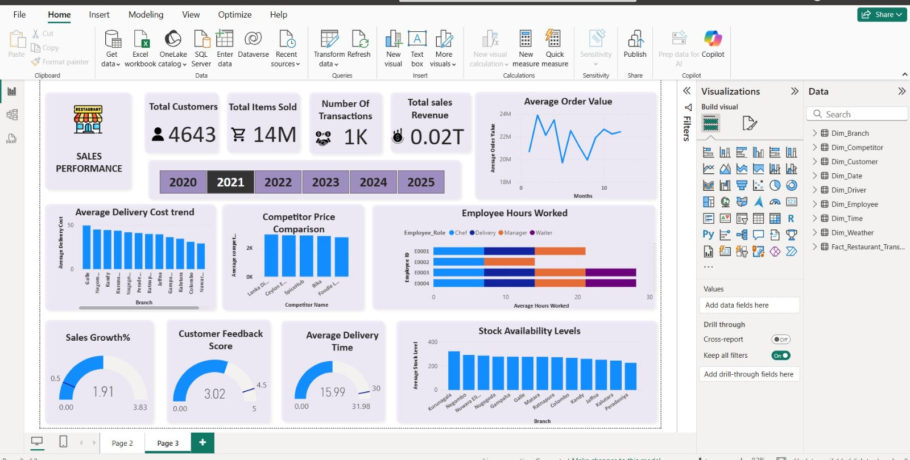

# Restaurant BI Framework for Sales Analysis

A comprehensive Business Intelligence framework designed to analyze and optimize restaurant sales performance. This project integrates SQL Server for data warehousing, SSAS Tabular for semantic modeling, and Power BI for interactive data visualization.

## 🚀 Project Overview

This framework provides a robust pipeline to transform raw restaurant transaction data into actionable insights. It covers everything from ETL processes and star-schema design to advanced DAX calculations and executive-level dashboards.

## 🏗️ Architecture

The project follows a classic BI architecture:
1.  **Data Source:** Raw restaurant transaction data (SQL Server).
2.  **ETL & Data Warehouse:** Dimensional modeling using Star Schema (Fact and Dimension tables).
3.  **Semantic Layer:** SSAS Tabular model built with Visual Studio for high-performance querying and DAX metrics.
4.  **Visualization:** Power BI Dashboards for end-user reporting.

### Data Schema

## 📊 Dashboards

### Sales Performance Overview
Comprehensive view of sales trends, branch performance, and key metrics.

### Operational Insights
Deep dive into order types, customer loyalty, and delivery efficiency.

## 🛠️ Technologies Used

*   **Database:** Microsoft SQL Server
*   **Modeling:** Analysis Services (Tabular Model)
*   **Development:** Visual Studio (SSDT)
*   **Visualization:** Power BI
*   **Languages:** T-SQL, DAX

## 📂 Project Structure

*   `TabularProject3/`: SSAS Tabular model project files.
*   `Sales_Performance.pbix`: Power BI report file.
*   `code1.txt`, `code2.txt`, `code3.txt`: SQL scripts for table creation and ETL processing.
*   `images/`: Contains schema and dashboard screenshots.
*   `Restaurant_BI_Framework_Final_Presentation 1.pptx`: Final project presentation.

## 🔧 Setup Instructions

1.  **Database:** Execute the SQL scripts in `code1.txt`, `code2.txt`, and `code3.txt` to set up the data warehouse on your SQL Server instance.
2.  **Tabular Model:** Open the solution in `TabularProject3/` using Visual Studio and deploy the model to your SSAS instance.
3.  **Power BI:** Open `Sales_Performance.pbix` and update the data source settings to point to your deployed SSAS Tabular model.
